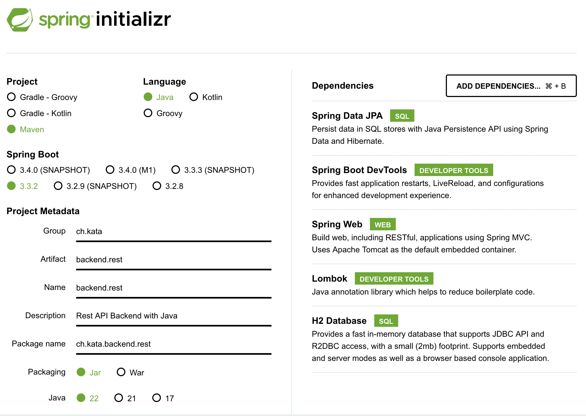

# Kata 01 - Springboot reading JSON files on the backend
This is a java kata for reading data from a json file and to load into an H2 memory database.
Reading data over an REST Endpoint to get information.
This can be used to mock data for Frontend development and testing.

## Java Project init setup
Chose your JDK, Springboot version or Task Runner (maven in my case).
Optional Dependencies are:
- Spring Boot DevTools
- Lombok

